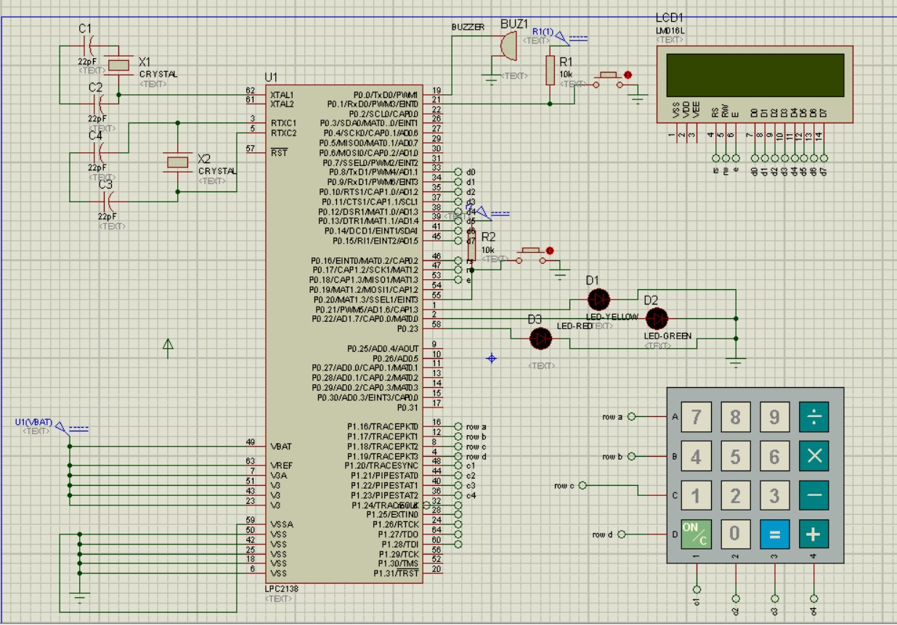
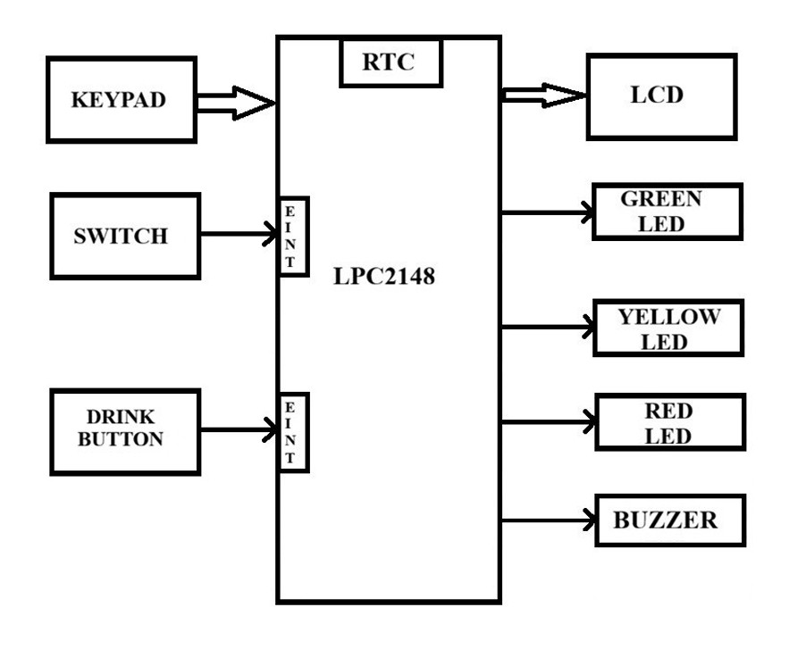
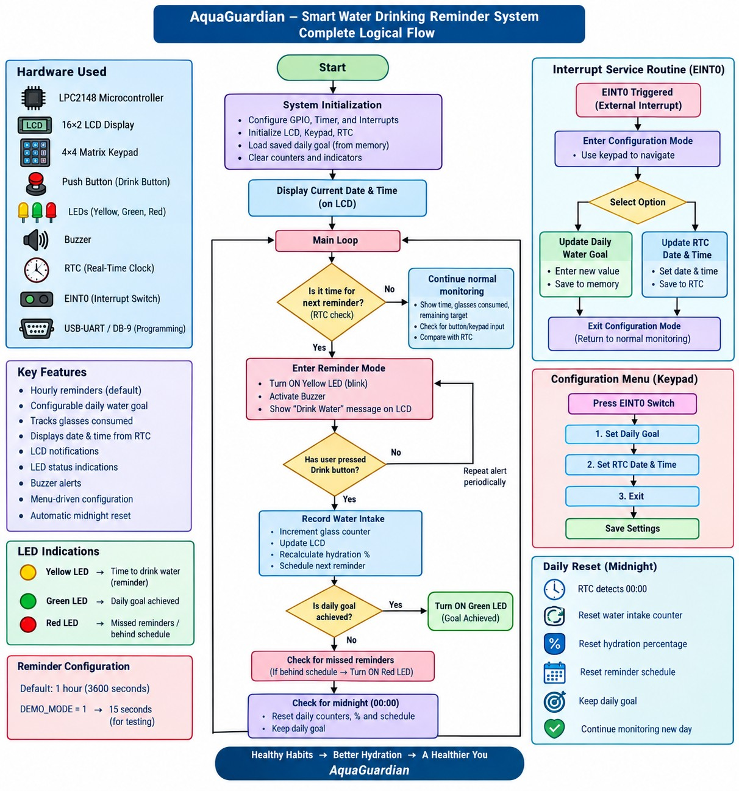

# AquaGuardian — Smart Water Drinking Reminder System

> **An ARM7/LPC2148 embedded system for scheduled water-drinking reminders, daily intake tracking, configurable hydration targets, and real-time user feedback.**

[](#hardware)
[](#software-architecture)
[](#building-with-keil-%C2%B5vision)
[](#proteus-simulation)
[](#software-architecture)

---

## Table of Contents

- [1. Project Story](#1-project-story)
- [2. System Overview](#2-system-overview)
- [3. System Architecture](#3-system-architecture)
- [4. Hardware](#4-hardware)
- [5. Pin Mapping](#5-pin-mapping)
- [6. User Interface](#6-user-interface)
- [7. Firmware Behavior](#7-firmware-behavior)
- [8. Software Architecture](#8-software-architecture)
- [9. Repository Structure](#9-repository-structure)
- [10. Building with Keil µVision](#10-building-with-keil-µvision)
- [11. GCC / GNU Arm Toolchain](#11-gcc--gnu-arm-toolchain)
- [12. Programming the LPC2148](#12-programming-the-lpc2148)
- [13. Proteus Simulation](#13-proteus-simulation)
- [14. Testing and Validation](#14-testing-and-validation)
- [15. Results and Current Status](#15-results-and-current-status)
- [16. Engineering Notes and Known Gaps](#16-engineering-notes-and-known-gaps)
- [17. Conventional Commits](#17-conventional-commits)
- [18. GitHub Development Workflow](#18-github-development-workflow)
- [19. Future Enhancements](#19-future-enhancements)
- [20. Viva / One-Minute Explanation](#20-viva--one-minute-explanation)
- [21. Conclusion](#21-conclusion)
- [License](#license)

---

# 1. Project Story

## 1.1 The problem

During work, study, travel, or long periods of concentration, people can forget to drink water at regular intervals. A simple alarm can provide a reminder, but an embedded hydration system can go further by allowing the user to record intake, maintain a daily target, show remaining glasses, count missed reminders, and provide configurable operation.

The engineering problem is therefore:

```text
How can a small embedded controller provide
reliable time-based hydration reminders while
also tracking user input and daily progress?
```

## 1.2 The AquaGuardian solution

AquaGuardian addresses the problem with a compact LPC2148-based embedded system.

The system combines:

- an **LPC2148 ARM7 microcontroller**;
- the LPC2148 **on-chip RTC** for timekeeping;
- a **16×2 LCD** for status and user messages;
- a **4×4 matrix keypad** for configuration;
- a **manual water switch** for recording intake;
- an **external interrupt switch** for entering configuration mode;
- **yellow, green and red LEDs** for status indication;
- a **buzzer** for audible reminders.

The resulting story is:

```text
                    THE PROBLEM
                        │
                        ▼
              User forgets to drink
                        │
                        ▼
               AQUAGUARDIAN
                        │
          ┌─────────────┼─────────────┐
          ▼             ▼             ▼
       KEEP TIME     TRACK INTAKE   REMIND USER
          │             │             │
         RTC        Water counter   LCD + LED
          │             │          + Buzzer
          └─────────────┼─────────────┘
                        ▼
                DAILY STATUS
                        │
             ┌──────────┼──────────┐
             ▼          ▼          ▼
          Monitor    Configure    Respond
             │          │          │
             └──────────┼──────────┘
                        ▼
                   TEST + VERIFY
```

## 1.3 Repository story

The repository is intentionally organized so that a reviewer can follow the engineering process from the problem to the result:

```text
Problem
   ↓
AquaGuardian solution
   ↓
Hardware
   ↓
Software architecture
   ↓
Source code
   ↓
Logical flow
   ↓
Testing
   ↓
Results
```

That sequence is the main design principle of this README.

---

# 2. System Overview

## 2.1 What the system does

The current firmware provides the following core behavior:

1. Initializes the LPC2148 GPIO, LCD, keypad, RTC and external interrupt.
2. Maintains time using the LPC2148 RTC.
3. Displays the current time and hydration status on the LCD.
4. Maintains a configurable daily glass target.
5. Allows the user to record a glass using the manual water switch.
6. Decrements the remaining glass count after a valid water event.
7. Restarts the reminder countdown after water is recorded.
8. Generates a drinking reminder when the configured interval expires.
9. Uses the yellow LED and buzzer during the reminder alert.
10. Accepts water intake during the reminder window.
11. Records a missed reminder when the reminder window expires without intake.
12. Uses the red LED/buzzer for the missed-reminder indication.
13. Uses the green LED for successful water logging and goal completion.
14. Provides keypad-based configuration for time, reminder interval and target.
15. Detects a new RTC day and resets daily runtime counters automatically.

## 2.2 Default operating values

| Parameter | Current value |
|---|---:|
| Microcontroller | LPC2148 ARM7 |
| Default daily target | 8 glasses |
| Valid target range | 1–20 glasses |
| Normal reminder interval | 3600 s / 1 hour |
| Demo reminder interval | 15 s |
| Reminder alert window | 5 s |
| RTC peripheral clock assumption | 15 MHz |
| RTC starting time in source | 17:24:00 |
| RTC starting date in source | 31/07/2026 |
| `DEMO_MODE` default | `0` |

> **Important:** these values describe the current source implementation, not a generic product specification.

---

# 3. System Architecture

## 3.1 High-level architecture

AquaGuardian is organized into three practical software layers.

```text
┌──────────────────────────────────────────────────────────────┐
│                    APPLICATION LAYER                         │
│                                                              │
│  Main loop • application coordination • UI • configuration  │
│  reminder policy • daily reset sequencing                   │
├──────────────────────────────────────────────────────────────┤
│                      DOMAIN LAYER                            │
│                                                              │
│  WaterTaken • TotalGlass • RemainingGlass • MissCount       │
│  goal_done • reminder countdown                             │
├──────────────────────────────────────────────────────────────┤
│                       DRIVER LAYER                           │
│                                                              │
│  LCD • Keypad • RTC • GPIO • EINT0 • Delay                   │
├──────────────────────────────────────────────────────────────┤
│                    LPC2148 / ARM7                            │
│                                                              │
│  GPIO • RTC • VIC/EINT • clock • memory                      │
└──────────────────────────────────────────────────────────────┘
```

### Separation of concerns

- **Application layer** decides the sequence of system operations.
- **Domain logic** maintains hydration state and reminder-related data.
- **Drivers** isolate low-level hardware access.
- **Interrupt code** handles the external configuration event and returns control to the main application.

This separation makes the codebase easier to understand and reduces the amount of hardware-specific code exposed to application logic.

## 3.2 Hardware signal flow

```text
                    ┌──────────────────┐
                    │    LPC2148       │
                    │     ARM7         │
                    └────────┬─────────┘
                             │
       ┌─────────────────────┼─────────────────────┐
       │                     │                     │
       ▼                     ▼                     ▼
     INPUTS              TIME BASE              OUTPUTS
       │                     │                     │
 ┌─────┴──────┐             RTC            ┌──────┼─────────┐
 │            │              │              │      │         │
 ▼            ▼              ▼              ▼      ▼         ▼
Water       Config       Reminder        LCD     LEDs      Buzzer
Switch      EINT0        countdown
       │                     │
       └──────────┬──────────┘
                  ▼
          Hydration state
                  │
        ┌─────────┼─────────┐
        ▼         ▼         ▼
     Consumed  Remaining   Misses
```

---

# 4. Hardware

## 4.1 Hardware specification

| Component | Specification | Purpose |
|---|---|---|
| MCU | **LPC2148 ARM7** | Main controller |
| Display | **16×2 character LCD** | Time, hydration status, prompts and alerts |
| Input | **4×4 matrix keypad** | Configuration and numeric entry |
| Water input | Push-button / switch | Records water intake |
| Configuration input | External interrupt switch | Requests configuration mode |
| Indicators | Yellow, green, red LEDs | Reminder, successful/goal, missed status |
| Audible output | Buzzer | Reminder and alert feedback |
| Time base | LPC2148 on-chip RTC | Real-time clock and daily reset detection |
| Programming interface | USB-UART / DB-9-compatible arrangement | Firmware programming/debug workflow |
| Development | Keil µVision | Primary build environment |
| Simulation | Proteus | Hardware simulation |

## 4.2 Supplied circuit diagram

The supplied circuit diagram is included in the repository and should be kept with the project documentation.



**Figure 1 — Supplied AquaGuardian circuit / Proteus reference diagram.**

> **Engineering note:** the supplied circuit image visibly labels the MCU as **LPC2138** and uses an earlier pin arrangement. The current working firmware is explicitly written for **LPC2148** and uses the pin map in Section 5. The image is therefore retained as the supplied schematic reference, while Section 5 is the firmware baseline. These must be reconciled before treating the schematic as a release-validated Proteus design.

## 4.3 Supplied logical-flow / block-flow diagram

The project documentation also contains a complete logical-flow illustration.



**Figure 2 — Supplied AquaGuardian logical-flow diagram.**

> The supplied logical-flow graphic is useful as a system-design artifact. Some labels describe design intent that is broader than the current firmware implementation. For release documentation, the executable firmware remains the source of truth for actual behavior.


## 4.4 Hardware design principles

For physical hardware:

- LEDs should use suitable current-limiting resistors.
- A buzzer requiring more current than an LPC2148 GPIO can safely provide should use an appropriate transistor/driver stage.
- Supply, ground, reset and oscillator connections must be verified for the actual LPC2148 board.
- Programming/ISP connections must not conflict with application GPIO assignments.
- The Proteus component, Keil target and physical MCU part number must represent the same final hardware revision.

---

# 5. Pin Mapping

## 5.1 Current firmware pin map — source of truth

The working firmware defines the following logical assignments.

| Function | LPC2148 Port | Bit | Direction | Active behavior |
|---|---|---:|---|---|
| Buzzer | P0.0 | 0 | Output | Alert output |
| Configuration switch / EINT0 | P0.1 | 1 | Input | Active-low external interrupt |
| LCD D0 | P0.8 | 8 | Output | LCD data |
| LCD D1 | P0.9 | 9 | Output | LCD data |
| LCD D2 | P0.10 | 10 | Output | LCD data |
| LCD D3 | P0.11 | 11 | Output | LCD data |
| LCD D4 | P0.12 | 12 | Output | LCD data |
| LCD D5 | P0.13 | 13 | Output | LCD data |
| LCD D6 | P0.14 | 14 | Output | LCD data |
| LCD D7 | P0.15 | 15 | Output | LCD data |
| LCD RS | P0.16 | 16 | Output | LCD control |
| LCD RW | P0.17 | 17 | Output | LCD control |
| LCD EN | P0.18 | 18 | Output | LCD control |
| Manual water switch | P0.20 | 20 | Input | Active-low |
| Yellow LED | P0.21 | 21 | Output | Reminder indication |
| Green LED | P0.22 | 22 | Output | Successful intake / goal |
| Red LED | P0.23 | 23 | Output | Missed-reminder indication |
| Keypad Row 0 | P1.16 | 16 | Matrix I/O | Row scan |
| Keypad Row 1 | P1.17 | 17 | Matrix I/O | Row scan |
| Keypad Row 2 | P1.18 | 18 | Matrix I/O | Row scan |
| Keypad Row 3 | P1.19 | 19 | Matrix I/O | Row scan |
| Keypad Column 0 | P1.20 | 20 | Matrix I/O | Column scan |
| Keypad Column 1 | P1.21 | 21 | Matrix I/O | Column scan |
| Keypad Column 2 | P1.22 | 22 | Matrix I/O | Column scan |
| Keypad Column 3 | P1.23 | 23 | Matrix I/O | Column scan |

### Firmware wiring summary

```text
LPC2148
│
├── P0.0   ─────────── Buzzer
├── P0.1   ─────────── Configuration switch / EINT0
│
├── P0.8   ─────────── LCD D0
├── P0.9   ─────────── LCD D1
├── P0.10  ─────────── LCD D2
├── P0.11  ─────────── LCD D3
├── P0.12  ─────────── LCD D4
├── P0.13  ─────────── LCD D5
├── P0.14  ─────────── LCD D6
├── P0.15  ─────────── LCD D7
├── P0.16  ─────────── LCD RS
├── P0.17  ─────────── LCD RW
├── P0.18  ─────────── LCD EN
│
├── P0.20  ─────────── Manual water switch
├── P0.21  ─────────── Yellow LED
├── P0.22  ─────────── Green LED
├── P0.23  ─────────── Red LED
│
├── P1.16  ─────────── Keypad Row 0
├── P1.17  ─────────── Keypad Row 1
├── P1.18  ─────────── Keypad Row 2
├── P1.19  ─────────── Keypad Row 3
├── P1.20  ─────────── Keypad Column 0
├── P1.21  ─────────── Keypad Column 1
├── P1.22  ─────────── Keypad Column 2
└── P1.23  ─────────── Keypad Column 3
```

## 5.2 Schematic alignment requirement

The supplied circuit diagram and current firmware do **not** represent the same pin assignment baseline.

For example, the supplied schematic shows the LCD control signals on an earlier P0.5/P0.6/P0.7 arrangement, whereas the current firmware uses:

```text
LCD RS = P0.16
LCD RW = P0.17
LCD EN = P0.18
```

Similarly, the current firmware uses:

```text
Configuration switch = P0.1 / EINT0
Water switch          = P0.20
```

Therefore:

```text
FINAL HARDWARE
      =
PROTEUS SCHEMATIC
      =
KEIL TARGET
      =
STARTUP CONFIGURATION
      =
FIRMWARE PIN DEFINITIONS
```

must be true before a final hardware/simulation release is declared.

Do not change the working firmware pin definitions simply to hide a schematic mismatch. Reconcile the engineering artifacts deliberately.

---

# 6. User Interface

## 6.1 4×4 keypad layout

The firmware uses the following logical keypad map:

```text
┌─────┬─────┬─────┬─────┐
│  1  │  2  │  3  │  a  │
├─────┼─────┼─────┼─────┤
│  4  │  5  │  6  │  b  │
├─────┼─────┼─────┼─────┤
│  7  │  8  │  9  │  c  │
├─────┼─────┼─────┼─────┤
│  C  │  0  │  e  │  d  │
└─────┴─────┴─────┴─────┘
```

| Key | Meaning in configuration |
|---|---|
| `0–9` | Numeric entry |
| `C` | Backspace / delete |
| `e` | Enter / confirm |
| `d` | Skip / cancel |

The keys `a`, `b`, and `c` are part of the physical keypad map; their use depends on the corresponding configuration workflow in the current firmware.

## 6.2 Normal dashboard

During normal operation, the LCD provides the current time and hydration status.

The runtime state includes:

```text
TotalGlass       = Daily target
WaterTaken       = Glasses consumed
RemainingGlass   = Target - consumed
MissCount        = Missed reminder count
goal_done        = Goal completion state
```

## 6.3 Configuration entry

The dedicated configuration switch is connected to P0.1/EINT0.

The intended user sequence is:

```text
Normal monitoring
       │
       ▼
Configuration switch
       │
       ▼
CONFIG MODE
PRESS 'e' TO SET
       │
       ▼
1:TIME  2:INT
3:TARGET
       │
       ├──────────┬──────────┐
       ▼          ▼          ▼
      TIME     INTERVAL    TARGET
       │          │          │
       └──────────┴──────────┘
                  ▼
          Return to monitoring
```

## 6.4 Time configuration

The current firmware allows entry of:

```text
HH
MM
SS
```

with validation:

```text
Hour   : 0–23
Minute : 0–59
Second : 0–59
```

## 6.5 Reminder-interval configuration

The interval is entered as hours/minutes/seconds and converted into a total number of seconds used by the countdown logic.

A zero interval is handled by the current implementation with its defined fallback behavior.

## 6.6 Daily target configuration

The target is constrained to:

```text
1–20 glasses
```

Changing the target resets the relevant daily runtime counters according to the current firmware behavior.

---

# 7. Firmware Behavior

## 7.1 Initialization

At startup the firmware performs the following high-level sequence:

```text
Start
  │
  ├── Initialize keypad
  ├── Configure GPIO directions
  ├── Configure EINT0
  ├── Configure VIC
  ├── Configure RTC
  ├── Initialize LCD
  ├── Load custom LCD character
  ├── Set initial RTC values
  ├── Initialize hydration state
  └── Enter main loop
```

## 7.2 Main loop

The main loop repeatedly performs application-level checks.

```text
┌──────────────────────────────┐
│          Main Loop            │
└──────────────┬───────────────┘
               ▼
        New RTC day?
          │       │
         Yes      No
          │       │
          ▼       │
    Reset daily   │
       state      │
          │       │
          └───┬───┘
              ▼
       Water switch?
          │       │
         Yes      No
          │       │
          ▼       │
     Log water    │
          │       │
          └───┬───┘
              ▼
        RTC second changed?
              │
              ▼
       Update time/display
              │
              ▼
       Update countdown
              │
              ▼
        Reminder due?
          │       │
         No      Yes
          │       │
          │       ▼
          │   Reminder()
          │       │
          └───────┤
                  ▼
        Goal completed?
                  │
                  ▼
          Configuration mode?
                  │
                  ▼
             Repeat
```

## 7.3 Water logging

When the manual water switch is detected:

```text
Check switch
    ↓
Debounce
    ↓
Is goal already complete?
    ↓
No
    ↓
Increment WaterTaken
    ↓
Update RemainingGlass
    ↓
Restart reminder countdown
    ↓
Update LCD
```

The water count is not allowed to continue beyond the configured target.

## 7.4 Reminder behavior

The current firmware reminder sequence is:

```text
Reminder due
    ↓
Display "DRINK WATER NOW!"
    ↓
Display "PRESS SWITCH"
    ↓
Yellow LED + buzzer
    ↓
5-second alert window
    │
    ├── Water switch pressed
    │       ↓
    │   WaterTaken++
    │       ↓
    │   "GOOD JOB!"
    │       ↓
    │   "WATER LOGGED"
    │       ↓
    │   Green indication
    │
    └── No water input
            ↓
        MissCount++
            ↓
        "REMINDER MISSED!"
            ↓
        "MISS COUNT: xx"
            ↓
        Red LED + buzzer
```

### Important implementation detail

The current firmware uses a **5-second reminder alert window**. It does not keep a reminder active indefinitely until acknowledgement.

That distinction is documented deliberately so that the README does not overstate the current implementation.

## 7.5 Goal completion

When:

```text
WaterTaken >= TotalGlass
```

the application marks the daily goal as complete.

The green LED is used for the goal-completed indication and normal reminder processing is stopped for that day.

## 7.6 Daily reset

The firmware compares the current RTC day against the previously observed day.

When the day changes:

```text
WaterTaken     = 0
RemainingGlass = TotalGlass
MissCount      = 0
goal_done      = 0
```

The reminder countdown is restarted and status outputs are cleared.

The configured target remains in the runtime configuration.

---

# 8. Software Architecture

## 8.1 Why modularization matters

The original application was developed as a single C source file. It was reorganized into functional modules so that:

- low-level drivers are separated from application logic;
- responsibilities are easier to identify;
- source files are smaller and easier to review;
- interfaces are defined through headers;
- future changes have less impact on unrelated modules;
- the repository can be understood without reading one very large source file;
- test cases can be mapped to functional areas.

## 8.2 Source module responsibilities

| Module | Responsibility |
|---|---|
| `main.c` | Firmware entry point and main application execution |
| `app.c` | Application-level coordination |
| `lcd.c` | LCD low-level interface |
| `keypad.c` | 4×4 matrix keypad scanning |
| `rtc.c` | RTC-related handling |
| `gpio.c` | GPIO setup and hardware control |
| `interrupt.c` | EINT0 configuration and ISR |
| `ui.c` | LCD dashboard and user-interface rendering |
| `hydration.c` | Hydration state and target handling |
| `reminder.c` | Reminder sequence and alert behavior |
| `config.c` | Configuration menu and input processing |
| `delay.c` | Delay routines |
| `aquaguardian.h` | Common project definitions and shared declarations |

## 8.3 Interface principle

A module should expose only what other modules need.

For example:

```text
Application
    │
    ├── hydration API
    ├── reminder API
    ├── UI API
    └── configuration API
             │
             ▼
        Hardware drivers
             │
       ┌─────┼─────┐
       ▼     ▼     ▼
      LCD  Keypad  RTC
```

The goal is to avoid scattering direct register manipulation throughout application code.

---

# 9. Repository Structure

```text
AquaGuardian/
│
├── README.md
├── LICENSE
├── .gitignore
│
├── src/
│   ├── main.c
│   ├── app.c
│   ├── lcd.c
│   ├── keypad.c
│   ├── rtc.c
│   ├── gpio.c
│   ├── interrupt.c
│   ├── ui.c
│   ├── hydration.c
│   ├── reminder.c
│   ├── config.c
│   └── delay.c
│
├── inc/
│   ├── aquaguardian.h
│   ├── app.h
│   ├── lcd.h
│   ├── keypad.h
│   ├── rtc.h
│   ├── gpio.h
│   ├── interrupt.h
│   ├── ui.h
│   ├── hydration.h
│   ├── reminder.h
│   ├── config.h
│   └── delay.h
│
├── docs/
│   ├── AquaGuardian_Project_Report.pdf
│   ├── logical_flow.png
│   └── images/
│       ├── logical_flow.png
│       └── circuit_diagram.png
│
├── tests/
│   └── test_cases.md
│
└── legacy/
    └── AquaGuardian-1.c
```

## 9.1 Directory ownership

### `src/`

Production firmware implementation.

### `inc/`

Public module interfaces, declarations and shared definitions.

### `docs/`

Project report, supplied logical-flow documentation and hardware/schematic documentation.

### `tests/`

Functional test cases and validation records.

### `legacy/`

The original monolithic `AquaGuardian-1.c`, retained as a reference baseline.

---

# 10. Building with Keil µVision

Keil µVision is the primary build environment for the current LPC2148 firmware.

## 10.1 Project setup

Create/open the µVision project and select the **LPC2148** target used by the working firmware.

Add the source files from:

```text
src/
```

to the appropriate source group.

The headers in:

```text
inc/
```

do not need to be compiled as source files, but the directory must be visible to the compiler.

## 10.2 Configure the include path

Open:

```text
Project
    → Options for Target
        → C/C++
            → Include Paths
```

If the µVision project file is in the repository root:

```text
.\inc
```

If the µVision project is inside a subdirectory such as `Keil/`:

```text
..\inc
```

This prevents errors such as:

```text
cannot open source input file "app.h"
```

## 10.3 Configure the target

Verify:

- MCU selection;
- target crystal configuration;
- compiler settings;
- startup code;
- linker/memory configuration;
- output directory;
- HEX-file generation;
- debug configuration.

The startup file and linker configuration must correspond to the actual LPC2148 target.

## 10.4 Build

Use:

```text
Project → Build Target
```

or:

```text
F7
```

A release-oriented build should finish with:

```text
0 Error(s), 0 Warning(s)
```

Warnings should be investigated rather than ignored.

## 10.5 HEX generation

Enable:

```text
Options for Target
    → Output
        → Create HEX File
```

The resulting HEX file can then be used by the programming workflow or loaded into a compatible Proteus MCU model.

## 10.6 Known successful build baseline

The current project has been reported to build successfully in Keil with:

```text
0 Error(s), 0 Warning(s)
```

and the target executable/HEX output was generated.

---

# 11. GCC / GNU Arm Toolchain

## 11.1 Current status

The current firmware is **Keil-oriented and is not a drop-in GCC project**.

The source contains toolchain-specific elements and the vendor header:

```c
#include <LPC21xx.h>
```

The interrupt implementation also uses Keil-specific ARM interrupt syntax.

Therefore, GCC support should be treated as a **porting task**, not as an already-validated build path.

## 11.2 What a production GCC port requires

A proper GCC port should provide:

```text
toolchain/
├── startup.s
├── linker.ld
└── compiler abstraction
```

and resolve:

1. ARM7 reset/vector startup;
2. linker memory regions;
3. IRQ/vector handling;
4. LPC2148 register definitions;
5. compiler-specific interrupt attributes;
6. runtime/library assumptions;
7. final clock/startup configuration.

## 11.3 Typical GCC structure

Once the port is complete, the build can follow an architecture such as:

```bash
arm-none-eabi-gcc \
    -mcpu=arm7tdmi-s \
    -mthumb-interwork \
    -O2 \
    -Wall \
    -Wextra \
    -Iinc \
    -Ttoolchain/lpc2148.ld \
    startup.s \
    src/*.c \
    -o build/aquaguardian.elf
```

Then:

```bash
arm-none-eabi-objcopy \
    -O ihex \
    build/aquaguardian.elf \
    build/aquaguardian.hex
```

> These commands describe the intended GCC port structure. They are **not a claim that the current repository is already GCC-build validated**.

## 11.4 GCC acceptance criteria

A GCC port should not be considered complete until it passes:

```text
Compile
   ↓
Link
   ↓
HEX generation
   ↓
Flash/program
   ↓
Hardware smoke test
   ↓
Functional test suite
```

with the same pin map and functional behavior as the validated Keil build.

---

# 12. Programming the LPC2148

After a successful build:

1. Verify the correct LPC2148 target is selected.
2. Generate the HEX file.
3. Connect the programming interface used by the board.
4. Put the device into the required ISP/programming state.
5. Program the HEX image.
6. Reset the MCU.
7. Verify LCD initialization.
8. Verify the keypad and switches.
9. Verify LED and buzzer behavior.
10. Execute the functional test cases.

The programming method depends on the actual LPC2148 board and programmer/interface being used.

---

# 13. Proteus Simulation

## 13.1 Simulation objective

Proteus should reproduce the same electrical interface used by the firmware.

The fundamental rule is:

```text
Proteus wiring
      ↓
must match
      ↓
firmware pin definitions
```

not the other way around.

## 13.2 Required firmware connections

```text
LPC2148
│
├── LCD
│   ├── D0–D7 → P0.8–P0.15
│   ├── RS    → P0.16
│   ├── RW    → P0.17
│   └── EN    → P0.18
│
├── Keypad
│   ├── Rows → P1.16–P1.19
│   └── Cols → P1.20–P1.23
│
├── Buzzer → P0.0
├── Config/EINT0 switch → P0.1
├── Water switch → P0.20
├── Yellow LED → P0.21
├── Green LED → P0.22
└── Red LED → P0.23
```

## 13.3 Proteus setup sequence

### Step 1 — Place components

At minimum:

- LPC2148;
- 16×2 LCD;
- 4×4 matrix keypad;
- water push-button/switch;
- configuration switch;
- yellow LED;
- green LED;
- red LED;
- buzzer;
- required oscillator/reset/power components.

### Step 2 — Wire the MCU

Use the pin table in Section 5 as the firmware interface baseline.

### Step 3 — Configure the LCD

Connect the LCD in 8-bit mode:

```text
D0 → P0.8
D1 → P0.9
D2 → P0.10
D3 → P0.11
D4 → P0.12
D5 → P0.13
D6 → P0.14
D7 → P0.15
RS → P0.16
RW → P0.17
EN → P0.18
```

### Step 4 — Configure keypad

```text
Rows:    P1.16–P1.19
Columns: P1.20–P1.23
```

Verify that the physical keypad orientation corresponds to the firmware lookup table.

### Step 5 — Configure switches

```text
P0.20 → Water input
P0.1  → Configuration/EINT0 input
```

### Step 6 — Configure indicators

```text
P0.21 → Yellow
P0.22 → Green
P0.23 → Red
P0.0  → Buzzer
```

### Step 7 — Load the HEX file

Open the LPC2148 component properties and select the HEX output generated by the current firmware build.

### Step 8 — Run a smoke test

Verify:

```text
Power-up
  ↓
LCD initializes
  ↓
RTC advances
  ↓
Water switch works
  ↓
Configuration switch works
  ↓
Keypad responds
  ↓
LEDs respond
  ↓
Buzzer responds
  ↓
Reminder appears in demo mode
```

## 13.4 Fast reminder testing

For demonstration:

```c
#define DEMO_MODE 1
```

This uses a 15-second reminder interval.

For normal operation:

```c
#define DEMO_MODE 0
```

which uses the 1-hour default interval.

Do not accidentally commit a demonstration build as the production configuration.

## 13.5 Proteus troubleshooting checklist

If physical hardware works but Proteus does not:

- [ ] Confirm the MCU model/part number.
- [ ] Confirm the correct HEX file is loaded.
- [ ] Confirm main oscillator wiring.
- [ ] Confirm reset wiring.
- [ ] Confirm power and ground.
- [ ] Confirm LCD D0–D7.
- [ ] Confirm LCD RS/RW/EN.
- [ ] Confirm all eight keypad lines.
- [ ] Confirm P0.20 water switch.
- [ ] Confirm P0.1/EINT0 configuration switch.
- [ ] Confirm all three LED pins.
- [ ] Confirm buzzer connection.
- [ ] Confirm switch polarity.
- [ ] Confirm keypad orientation.
- [ ] Confirm `DEMO_MODE` if testing reminders.
- [ ] Confirm that the schematic has been reconciled with the firmware pin map.

---

# 14. Testing and Validation

## 14.1 Test philosophy

Testing should connect the requirement to observable evidence:

```text
Requirement
    ↓
Implementation
    ↓
Build
    ↓
Hardware / Proteus
    ↓
Test case
    ↓
Expected result
    ↓
Actual result
    ↓
Pass / Fail
    ↓
Evidence
```

## 14.2 Functional test matrix

| ID | Test | Procedure | Expected result |
|---|---|---|---|
| TC01 | Power-up | Reset/power the controller | LCD and application initialize |
| TC02 | RTC | Observe the displayed clock | Time advances correctly |
| TC03 | Water input | Press manual water switch | Intake count increments |
| TC04 | Remaining target | Record water | Remaining glasses decrease |
| TC05 | Button debounce | Rapidly toggle/press switch | One intended event is recorded |
| TC06 | Reminder | Enable `DEMO_MODE=1` and wait | Reminder message appears |
| TC07 | Reminder indication | Observe reminder | Yellow LED and buzzer activate |
| TC08 | Reminder acknowledgement | Press water switch during alert | Water is logged and success indication occurs |
| TC09 | Missed reminder | Do not press water switch during alert | Miss counter increments and missed indication occurs |
| TC10 | Goal completion | Reach configured target | Goal-complete indication occurs |
| TC11 | Keypad | Enter valid menu values | Values are accepted |
| TC12 | Invalid time | Enter invalid hour/minute/second | Input is rejected |
| TC13 | Target limits | Enter values outside 1–20 | Value is constrained/rejected according to implementation |
| TC14 | Interval | Configure a new interval | Countdown uses the configured interval |
| TC15 | EINT0 | Activate configuration switch | Configuration mode is entered |
| TC16 | Daily reset | Advance RTC across day boundary | Daily counters reset |
| TC17 | Post-goal behavior | Continue pressing water input after goal | Normal goal-complete behavior remains protected |
| TC18 | Display update | Change hydration state | LCD reflects current state |

## 14.3 Test record template

For every release candidate, record:

```text
Test ID:
Firmware revision:
Build configuration:
Toolchain:
Date:
Hardware / Proteus:
Procedure:
Expected result:
Actual result:
Pass / Fail:
Evidence:
Notes:
```

## 14.4 Validation levels

### Level 1 — Build validation

```text
Compile → Link → HEX
```

Acceptance:

```text
0 errors
0 warnings
```

### Level 2 — Driver validation

Test:

- LCD;
- keypad;
- GPIO;
- RTC;
- interrupt.

### Level 3 — Application validation

Test:

- water logging;
- reminder scheduling;
- missed reminders;
- target completion;
- configuration;
- daily reset.

### Level 4 — System validation

Run the complete user scenario:

```text
Power on
   ↓
Monitor
   ↓
Reminder
   ↓
Drink
   ↓
Track progress
   ↓
Configure
   ↓
Continue monitoring
   ↓
Reach goal
   ↓
New day reset
```

---

# 15. Results and Current Status

## 15.1 Current implementation status

| Area | Status |
|---|---|
| Modular source organization | Implemented |
| LPC2148 firmware | Implemented |
| LCD driver | Implemented |
| Keypad scanning | Implemented |
| RTC handling | Implemented |
| Hydration tracking | Implemented |
| Reminder functionality | Implemented |
| Configuration workflow | Implemented |
| EINT0 configuration entry | Implemented |
| Daily reset logic | Implemented |
| Keil build | Successfully reported |
| Build result | 0 errors / 0 warnings |
| Physical hardware operation | Working as expected |
| GCC build | Requires toolchain port |
| Proteus schematic alignment | Requires reconciliation |
| Automated host-side unit tests | Future enhancement |

## 15.2 Engineering result

The project demonstrates integration of:

```text
ARM7 MCU
  +
GPIO
  +
LCD
  +
Matrix keypad
  +
RTC
  +
External interrupt
  +
Switch debounce
  +
Countdown scheduling
  +
Hydration state management
  +
Visual indication
  +
Audible indication
  +
Configuration UI
```

The important result is not only that the firmware runs, but that the repository now exposes the system as a set of understandable engineering layers.

---

# 16. Engineering Notes and Known Gaps

A production-grade README should distinguish implemented behavior from project-document intent.

## 16.1 Reminder persistence

The project report describes reminders continuing until acknowledgement.

The current firmware instead implements:

```text
Reminder starts
     ↓
5-second alert window
     ↓
Acknowledged → log water
Not acknowledged → count miss
```

Therefore the README documents the 5-second implementation.

## 16.2 Date configuration

The current configuration menu edits:

```text
HH / MM / SS
```

It does not provide a complete user-facing date-editing menu.

The RTC date is still used for new-day detection.

## 16.3 Hydration percentage

The current dashboard tracks:

```text
Consumed
Remaining
Miss count
```

and uses a custom glass/progress character.

A dedicated numeric hydration-percentage field is not part of the current dashboard implementation.

## 16.4 Non-volatile target storage

The current target is maintained in runtime variables.

The current firmware does not implement explicit EEPROM/Flash persistence for the target across a power cycle.

## 16.5 Supplied schematic mismatch

The supplied circuit image identifies an LPC2138 and an earlier pin assignment, while the working firmware identifies LPC2148 and uses the Section 5 mapping.

This is an engineering artifact mismatch that should be resolved before a final release.

The correct release process is:

```text
Choose final MCU
       ↓
Choose final pin map
       ↓
Update schematic
       ↓
Verify firmware
       ↓
Verify Keil target/startup
       ↓
Verify Proteus
       ↓
Run test suite
       ↓
Release
```

## 16.6 Why these limitations are documented

These notes are not defects hidden from the reviewer. They are traceability information.

A trustworthy embedded repository should clearly distinguish:

```text
Implemented
     vs
Designed
     vs
Tested
     vs
Planned
```

---

# 17. Conventional Commits

The team should use **Conventional Commits** so Git history communicates the engineering intent of every change.

## 17.1 Commit format

```text
<type>(<scope>): <description>
```

Example:

```text
feat(reminder): add configurable reminder interval
```

## 17.2 Recommended commit types

| Type | Meaning | Example |
|---|---|---|
| `feat` | New functionality | `feat(keypad): add target configuration` |
| `fix` | Bug fix | `fix(rtc): correct daily reset detection` |
| `refactor` | Code restructuring without intended behavior change | `refactor(lcd): isolate display driver` |
| `docs` | Documentation only | `docs(readme): update hardware pin map` |
| `test` | Tests or validation changes | `test(reminder): add missed-alert case` |
| `build` | Build/toolchain changes | `build(keil): add inc include path` |
| `ci` | Continuous-integration changes | `ci: add firmware build workflow` |
| `perf` | Performance/resource improvement | `perf(keypad): reduce scan overhead` |
| `style` | Formatting/style only | `style(src): normalize indentation` |
| `chore` | Maintenance that does not change application behavior | `chore: update gitignore` |
| `revert` | Revert a previous commit | `revert: revert reminder refactor` |

## 17.3 Scope examples

Use scopes that describe the affected module:

```text
lcd
keypad
rtc
gpio
interrupt
ui
hydration
reminder
config
app
build
docs
tests
proteus
```

## 17.4 Good commit examples

```text
feat(reminder): add 15 second demo interval
```

```text
fix(keypad): guard row and column lookup bounds
```

```text
refactor(hydration): move water state into dedicated module
```

```text
docs(readme): document LPC2148 pin assignments
```

```text
test(config): add invalid time input cases
```

```text
build(keil): configure inc include path
```

## 17.5 Commit message rules

Prefer:

```text
feat(lcd): add dashboard status rendering
```

Avoid:

```text
update code
```

Prefer:

```text
fix(reminder): reset countdown after water logging
```

Avoid:

```text
fixed bug
```

Keep the subject:

- imperative;
- concise;
- specific;
- free of unnecessary punctuation;
- focused on one logical change.

## 17.6 Breaking changes

For an incompatible interface change:

```text
refactor(lcd)!: change LCD driver interface
```

or include a footer:

```text
BREAKING CHANGE: LCD initialization now requires a configuration structure.
```

## 17.7 Recommended team workflow

```text
Create branch
     ↓
Make one logical change
     ↓
Build
     ↓
Run relevant tests
     ↓
Commit using Conventional Commits
     ↓
Review
     ↓
Merge
```

Example branch names:

```text
feature/keypad-config
fix/rtc-reset
refactor/hydration-module
docs/readme-update
test/reminder-cases
```

---

# 18. GitHub Development Workflow

## 18.1 Branch strategy

A lightweight embedded-team workflow can use:

```text
main
 │
 ├── feature/*
 ├── fix/*
 ├── refactor/*
 ├── test/*
 └── docs/*
```

Keep `main` buildable.

## 18.2 Pull-request checklist

Before merging:

- [ ] Code compiles.
- [ ] Build has 0 errors.
- [ ] Warnings have been reviewed.
- [ ] Relevant functional tests pass.
- [ ] Pin mapping is unchanged or documented.
- [ ] Documentation matches behavior.
- [ ] Proteus changes are tested when applicable.
- [ ] Commit messages follow Conventional Commits.
- [ ] No generated build artifacts are accidentally committed.
- [ ] No unrelated changes are included.

## 18.3 Release checklist

```text
Source
  ↓
Build
  ↓
0 errors / 0 warnings
  ↓
HEX generated
  ↓
Hardware smoke test
  ↓
Functional test matrix
  ↓
Proteus verification
  ↓
Documentation review
  ↓
Git tag / release
```

---

# 19. Future Enhancements

The following items are suitable future engineering work:

1. EEPROM/Flash persistence for the daily target.
2. Persistent hydration history.
3. Full RTC date/time configuration.
4. Numeric hydration-percentage display.
5. Timestamp logging for water events.
6. Reminder behavior that remains active until acknowledgement, if required by the final specification.
7. More non-blocking reminder handling.
8. Low-power sleep between events.
9. Daily/weekly hydration statistics.
10. Fully reconciled Proteus project matching the final LPC2148 firmware.
11. Automated unit tests for validation and calculation logic.
12. GCC/GNU Arm build support.
13. CI-based build and static-analysis checks.
14. Versioned hardware revisions and pin-map documents.

Future features should be introduced through the same traceability chain:

```text
Requirement
    ↓
Design
    ↓
Implementation
    ↓
Test
    ↓
Evidence
    ↓
Documentation
```

---

# 20. Viva / One-Minute Explanation

> **AquaGuardian is an LPC2148 ARM7-based smart water-drinking reminder system. The LPC2148 RTC provides the time reference for scheduling reminders and detecting a new day. A 16×2 LCD displays the current time and hydration status, while a 4×4 keypad allows the user to configure the reminder interval, clock time and daily water target. A manual water switch records each glass consumed. When the reminder interval expires, the system activates the yellow LED and buzzer and displays a drinking reminder. If water is recorded during the alert, the hydration counters are updated and a green indication is provided. If the alert expires without intake, the missed-reminder counter is incremented and the red indication is used. At a new RTC day, the daily runtime counters are reset while the configured target remains active. The firmware has been modularized into LCD, keypad, RTC, GPIO, interrupt, UI, hydration, reminder, configuration and application modules for maintainability and clear separation of responsibilities.**

## Key viva questions

### Why LPC2148?

Because the project needs GPIO, RTC, interrupt capability and sufficient processing resources in a single ARM7 microcontroller platform.

### Why use the RTC?

The RTC provides the time reference needed for displaying time, scheduling the reminder interval and detecting the beginning of a new day.

### Why use a keypad?

The keypad provides a compact user interface for entering numeric configuration values.

### Why use an external interrupt?

The configuration switch is connected to EINT0 so that the application can request configuration mode through an interrupt event.

### What happens when water is recorded?

The firmware increments `WaterTaken`, updates `RemainingGlass`, updates the display and restarts the reminder countdown.

### What happens when a reminder is missed?

`MissCount` is incremented and the missed-reminder indication is displayed using the red LED and buzzer.

### What happens when the goal is reached?

`goal_done` is set and the green LED is used for the goal-completion indication. Normal reminder processing is stopped for the day.

### How can the reminder be demonstrated quickly?

Set:

```c
#define DEMO_MODE 1
```

The demonstration interval is 15 seconds instead of the normal 3600-second interval.

---

# 21. Conclusion

AquaGuardian demonstrates how several fundamental embedded-system concepts can be integrated into one application:

```text
LPC2148 ARM7
    +
RTC timekeeping
    +
GPIO
    +
LCD driver
    +
4×4 keypad
    +
External interrupt
    +
Debounced switch input
    +
Reminder scheduling
    +
Hydration state management
    +
LED / buzzer feedback
    +
Configuration interface
    +
Daily reset
```

The repository is intentionally structured to tell a complete engineering story:

```text
┌───────────────────────────────────────────────┐
│                    PROBLEM                    │
│        User forgets regular water intake      │
└────────────────────────┬──────────────────────┘
                         ▼
┌───────────────────────────────────────────────┐
│                AQUAGUARDIAN                   │
│     RTC + tracking + reminders + feedback     │
└────────────────────────┬──────────────────────┘
                         ▼
┌───────────────────────────────────────────────┐
│                   HARDWARE                    │
│       LPC2148 • LCD • Keypad • LEDs • Buzzer  │
└────────────────────────┬──────────────────────┘
                         ▼
┌───────────────────────────────────────────────┐
│             SOFTWARE ARCHITECTURE             │
│      Application • Domain • Drivers • IRQ     │
└────────────────────────┬──────────────────────┘
                         ▼
┌───────────────────────────────────────────────┐
│                  SOURCE CODE                  │
│                   src/ + inc/                 │
└────────────────────────┬──────────────────────┘
                         ▼
┌───────────────────────────────────────────────┐
│                 LOGICAL FLOW                  │
│        RTC → decision → reminder → input      │
└────────────────────────┬──────────────────────┘
                         ▼
┌───────────────────────────────────────────────┐
│                    TESTING                    │
│       Build + hardware + Proteus + cases      │
└────────────────────────┬──────────────────────┘
                         ▼
┌───────────────────────────────────────────────┐
│                    RESULTS                    │
│     Working firmware + validated test flow     │
└───────────────────────────────────────────────┘
```

The central engineering principle is simple:

> **Document what the firmware actually implements, verify what the hardware actually executes, and keep the schematic, source code, build configuration, tests and documentation synchronized.**

---

# License

See [`LICENSE`](LICENSE) for the repository license.
