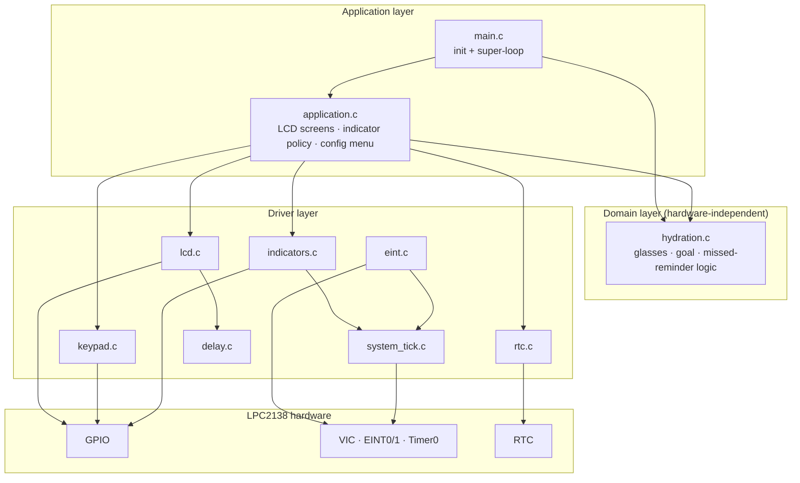
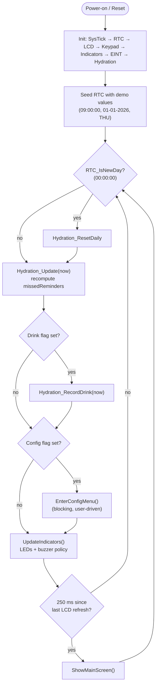
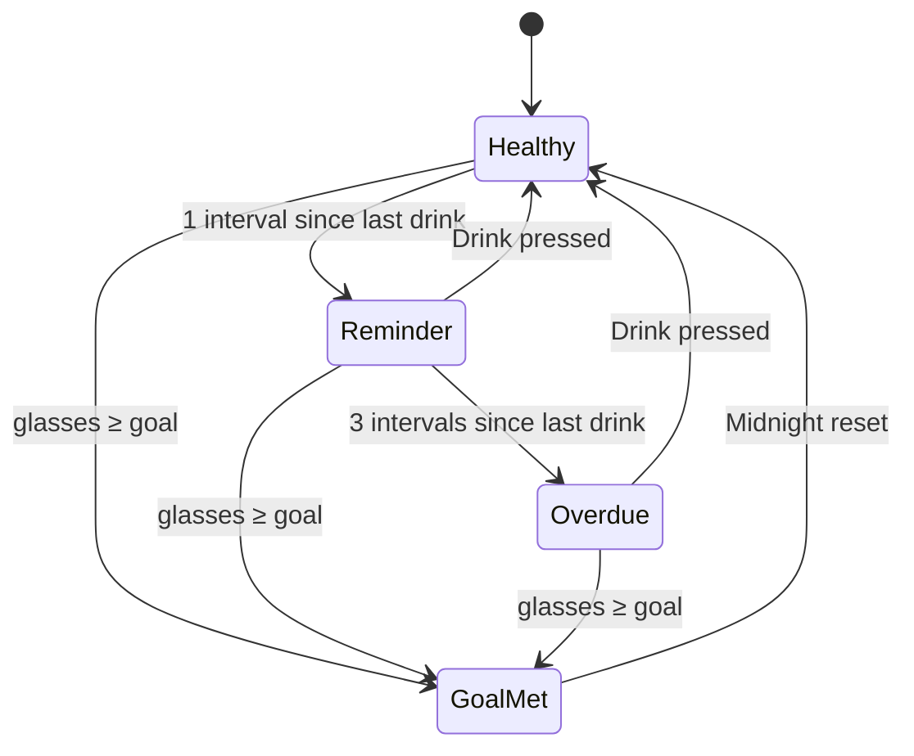
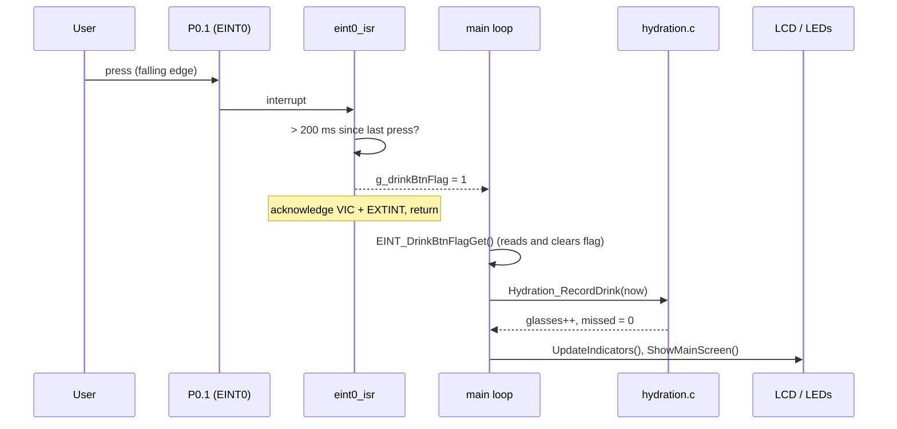

<div align="center">
💧 AquaGuardian
A standalone, RTC-driven smart water-drinking reminder built on the ARM7 LPC2138
-0091BD)


No phone. No app. No cloud. Just a small device that quietly keeps you hydrated.
</div>
---
📖 The Story in One Page
This README is written to be read top to bottom. Each chapter answers the question the previous one raised.
#	Chapter	The question it answers
1	The Problem	Why does this project exist?
2	The AquaGuardian Solution	What does the device do?
3	Hardware	What is it built from, and how is it wired?
4	Software Architecture	How is the firmware organised?
5	Source Code	Where does each responsibility live?
6	Logical Flow	What happens, step by step, at run time?
7	Build, Flash & Simulate	How do I run it myself?
8	Testing	How do we know it works?
9	Results	What is verified so far, and what is still open?
10	Known Issues & Roadmap	What must be fixed before shipping?
11	Contributing	How do we work together?
> ⚠️ **Read [Chapter 10](#10--known-issues--roadmap) before building.** The current sources and the Proteus schematic disagree on several pins, and the modular split has one compile-blocking omission. Both are documented with exact fixes.
---
1 · The Problem
Most people drink less water than they think. Dehydration is rarely dramatic; it shows up as tiredness, headaches and poor concentration, and the cause is usually not laziness but forgetting.
Existing solutions each have a weakness:
Phone apps need a phone nearby, compete with every other notification, and are easily dismissed.
Smart bottles are expensive, need charging, and lock you into a vendor's ecosystem.
Sticky notes and alarms are static. They do not know whether you already drank.
What is missing is a small, dedicated, always-on device that knows the time, counts what you drank, and escalates only when you are falling behind.
That is an ideal fit for a microcontroller: a real-time clock, a few buttons, a few LEDs, a display, and a few hundred lines of deterministic C.
---
2 · The AquaGuardian Solution
AquaGuardian sits on a desk and does four things:
Keeps time with the on-chip RTC and resets its counters automatically at midnight.
Counts glasses each time you press the Drink button.
Reminds you when an interval passes without a drink, and escalates if you keep ignoring it.
Celebrates when you reach your daily goal.
Behaviour at a glance
Situation	Green LED	Yellow LED	Red LED	Buzzer	LCD status (line 2)
Hydrated, no reminder due	off	off	off	off	`HEALTHY`
≥ 1 interval since last drink	off	blinks 600 ms	off	beeps with yellow	`TIME:H2O`
≥ 3 intervals since last drink	off	blinks 300 ms	on	beeps with yellow	`DRINK NOW!`
Daily goal reached	on	off	off	off	`GOAL MET`
Priority is Goal met → Overdue → Reminder → Idle. Defaults: goal = 8 glasses, reminder interval = 3600 s, overdue threshold = 3 missed reminders (all in `inc/hydration.h`).
Key features
RTC-based time, date and weekday
Configurable daily goal and clock via a 4×4 keypad menu
Interrupt-driven Drink button (EINT0) and Config switch with 200 ms software debounce
Non-blocking main loop with a Timer0 1 ms system tick
Clean driver / domain / application layering; hardware logic is separated from hydration logic
System block diagram
The block diagram below is the design intent: inputs on the left, the MCU with its RTC in the centre, outputs on the right.
<div align="center">

Figure 1: Keypad, config switch and drink button feed the MCU; the LCD, three LEDs and a buzzer are driven from it. The RTC is internal to the MCU.
</div>
> The figure labels the MCU "LPC2148". The target device for this project is the **LPC2138** (see the schematic in Chapter 3 and [Known Issue #3](#10--known-issues--roadmap)).
---
3 · Hardware
3.1 Specifications
Item	Specification
MCU	NXP LPC2138, ARM7TDMI-S, 32-bit, up to 60 MHz
Main clock	12 MHz crystal (X1) with 2 × 22 pF load capacitors, PLL ×5 → CCLK = 60 MHz
Peripheral clock	VPB divider ÷4 → PCLK = 15 MHz
RTC	On-chip RTC (pins RTXC1/RTXC2 carry crystal X2 with 2 × 22 pF, backup supply on VBAT). Firmware derives the 1 Hz count from PCLK via PREINT/PREFRAC.
Display	16 × 2 character LCD (HD44780-compatible, LM016L in Proteus), 8-bit interface
Keypad	4 × 4 matrix keypad (calculator-style face, see layout below), scanned row-out / column-in
Inputs	1 × Drink push button (EINT0), 1 × Config switch, each with a 10 kΩ pull-up, active-low
Indicators	3 × LEDs (green / yellow / red), 1 × buzzer
Supply	3.3 V (VBAT, VREF, V3A, V3 tied to 3.3 V; all VSS/VSSA to ground)
Keypad key map (matches the schematic face and `KPMLUT` in `src/keypad.c`):
```text
          C1   C2   C3   C4
   R0 (A)  7    8    9    /
   R1 (B)  4    5    6    *
   R2 (C)  1    2    3    -
   R3 (D)  C    0    =    +        C = "ON/C" key
```
3.2 Schematic
<div align="center">

Figure 2: Proteus schematic of the complete system.
</div>
3.3 Pin mapping
The Schematic columns are read directly from Figure 2 and are the source of truth for the hardware. The Firmware column is what `inc/io_defines.h` currently uses.
Legend: ✅ firmware and schematic agree · ❌ they disagree and one side must change before the Proteus simulation will behave correctly (see Known Issue #2).
Inputs
Signal	Dir	Schematic pin	Pkg pin	Notes	Firmware (`io_defines.h`)	Match
Drink button	In	P0.1 / EINT0	21	R1 10 kΩ pull-up, active-low, falling edge	`DRINK_BTN_PIN 1` (EINT0, VIC ch 14)	✅
Config switch	In	P0.20 / EINT3	55	R2 10 kΩ pull-up, active-low	`CFG_SW_PIN 3` → P0.3 / EINT1 (VIC ch 15)	❌
LCD (LM016L, 8-bit mode)
Signal	Dir	Schematic pin	Pkg pin	Firmware	Match
RS	Out	P0.5	29	`LCD_RS 16` → P0.16	❌

RW	Out	P0.6	30	`LCD_RW 17` → P0.17	❌
E	Out	P0.7	31	`LCD_EN 18` → P0.18	❌
D0	Out	P0.8	33	`LCD_DATA 8` (D0 = P0.8)	✅
D1	Out	P0.9	34	↳	✅
D2	Out	P0.10	35	↳	✅
D3	Out	P0.11	37	↳	✅
D4	Out	P0.12	38	↳	✅
D5	Out	P0.13	39	↳	✅
D6	Out	P0.14	41	↳	✅
D7	Out	P0.15	45	↳	✅
Indicators
Signal	Dir	Schematic pin	Pkg pin	Firmware	Match
Yellow LED (D1)	Out	P0.21	1	`LED_YELLOW_PIN 5` → P0.5	❌
Green LED (D2)	Out	P0.22	2	`LED_GREEN_PIN 4` → P0.4	❌
Red LED (D3)	Out	P0.23	58	`LED_RED_PIN 6` → P0.6	❌
Buzzer (BUZ1)	Out	P0.0	19	`BUZZER_PIN 7` → P0.7	❌
Keypad (matrix, port 1)
Signal	Dir	Schematic pin	Pkg pin	Firmware	Match
Row A (7 8 9 /)	Out	P1.16	16	`ROW0 16` (rows = P1.16–P1.19)	✅
Row B (4 5 6 *)	Out	P1.17	12	↳	✅
Row C (1 2 3 -)	Out	P1.18	8	↳	✅
Row D (C 0 = +)	Out	P1.19	4	↳	✅
Col 1	In	P1.20	48	`COL0 20` (cols = P1.20–P1.23)	✅
Col 2	In	P1.21	44	↳	✅
Col 3	In	P1.22	40	↳	✅
Col 4	In	P1.23	36	↳	✅
Clock, reset and power
Function	Pin(s)	Notes
XTAL1 / XTAL2	62 / 61	Crystal X1 + C1, C2 (22 pF). Firmware assumes 12 MHz (`FOSC`); the crystal value is not annotated in the schematic.
RTXC1 / RTXC2	3 / 5	Crystal X2 + C3, C4 (22 pF). Intended as the 32.768 kHz RTC crystal (value not annotated).
RST	57	Reset input
VBAT	49	RTC backup supply
VREF / V3A / V3	63 / 7 / 51, 43, 23	3.3 V rails
VSSA / VSS	59 / 50, 42, 25, 18, 6	Ground
3.4 Hardware notes for a real board
LEDs: the schematic shows no series resistors. Fine in simulation; on hardware add roughly 330 Ω per LED.
Buzzer: the schematic drives it straight from a GPIO, while the firmware comment says "via NPN transistor". A transistor driver is recommended for any real buzzer.
ISP pins: on LPC21xx parts, P0.0/P0.1 are UART0 (used by the serial bootloader) and P0.14 is the ISP-entry pin (held low at reset to enter the bootloader). The current mapping puts the buzzer on P0.0, the Drink button on P0.1 and LCD D6 on P0.14. Make sure none of them interferes when you program the chip with Flash Magic.
---
4 · Software Architecture
The firmware is a cooperative super-loop with two interrupt sources. Interrupt handlers do the minimum (set a flag, bump a counter); all decisions happen in the main loop.

Design principles
Separation of concerns. `hydration.c` has no register access, so its logic can be unit-tested on a PC.
Interrupts stay tiny. `eint.c` and `system_tick.c` only set flags and advance a counter.
No busy-waiting on the hot path. LEDs and buzzer blink from the millisecond tick, not from `delay_ms()`.
Blocking only where the user expects it. The keypad configuration menu is entered on demand from the config switch and blocks by design.
Wrap-safe timing. `TickElapsed()` uses unsigned subtraction, so it survives tick-counter overflow.
Clock tree
```text
12 MHz crystal ──► PLL ×5 ──► CCLK = 60 MHz ──► VPBDIV ÷4 ──► PCLK = 15 MHz
                                                                  ├─► Timer0: PR = 14 → 1 MHz, MR0 = 999 → 1 kHz (1 ms tick)
                                                                  └─► RTC:    PREINT = 456, PREFRAC = 25024 → 1 Hz
```
The firmware assumes the PLL and VPBDIV are already configured by the startup code (see Build).
---
5 · Source Code
5.1 Repository layout
```text
AquaGuardian/
├── README.md                     ← you are here
├── LICENSE                       MIT
├── .gitignore                    Keil / Proteus / IDE artefacts
│
├── inc/                          Public headers (one per module)
│   ├── types.h                   u8 / u32 / s32 / f32 typedefs
│   ├── defines.h                 bit / nibble / byte manipulation macros
│   ├── io_defines.h              Pin numbers, VIC channels, LCD & keypad bases
│   ├── delay.h
│   ├── system_tick.h
│   ├── rtc.h
│   ├── lcd.h
│   ├── keypad.h
│   ├── indicators.h
│   ├── eint.h
│   ├── hydration.h               HydrationState_t + tunable constants
│   └── application.h
│
├── src/                          Implementations
│   ├── main.c                    Init sequence + super-loop
│   ├── application.c             LCD screens, indicator policy, config menu
│   ├── hydration.c               Domain logic (no register access)
│   ├── rtc.c
│   ├── lcd.c
│   ├── keypad.c
│   ├── indicators.c
│   ├── eint.c
│   ├── system_tick.c
│   └── delay.c
│
├── docs/
│   ├── images/
│   │   ├── block_diagram.png     Figure 1
│   │   └── circuit_diagram.png   Figure 2
│   ├── block_diagram.md          ASCII block diagram
│   ├── pin_configuration.md      Original pin table (superseded by Chapter 3)
│   ├── MODULARIZATION.md         How the single file was split
│   └── AquaGuardian_original.c   Original single-file source, kept for diffing
│
├── proteus/                      (add) .pdsprj simulation project
├── hex/                          (add) released .hex files
└── screenshots/                  (add) simulation captures used in Chapter 9
```
> `proteus/`, `hex/` and `screenshots/` are empty today. Git does not track empty directories, so add a `.gitkeep` file to each.
5.2 Module reference
Module	Responsibility	Key API
`main.c`	Bring-up order, then the super-loop	`main()`
`application.c`	What the user sees and hears: main screen, indicator policy, config menu	`ShowMainScreen`, `UpdateIndicators`, `EnterConfigMenu`
`hydration.c`	Pure logic: glasses, goal, missed-reminder count	`Hydration_Init/Update/RecordDrink/ResetDaily/SetGoal`, `Hydration_GoalAchieved`, `Hydration_ReminderActive`
`rtc.c`	RTC init, time/date/weekday access, seconds-since-midnight, one-shot midnight detect	`RTC_Init`, `RTC_SetTime/GetTime`, `RTC_SetDate/GetDate`, `RTC_SecondsSinceMidnight`, `RTC_IsNewDay`
`lcd.c`	8-bit HD44780 driver	`InitLCD`, `CmdLCD`, `CharLCD`, `StrLCD`, `U32LCD`
`keypad.c`	Matrix scan and number entry	`Init_KPM`, `keyscan`, `ReadNum`
`indicators.c`	LEDs, buzzer, tick-based blink	`LED_Green/Yellow/Red`, `Buzzer`, `Indicators_ServiceBlink`
`eint.c`	Button interrupts with debounce; flag hand-off to main loop	`EINT_Init`, `EINT_DrinkBtnFlagGet`, `EINT_CfgBtnFlagGet`
`system_tick.c`	Timer0 1 ms tick	`SysTick_Init`, `GetTick`, `TickElapsed`
`delay.c`	Calibrated busy-wait for LCD timing	`delay_us`, `delay_ms`
5.3 The central data structure
```c
typedef struct {
    u32 glassesConsumed;       /* glasses drunk today                    */
    u32 dailyGoal;             /* target (default 8)                     */
    u32 reminderIntervalSec;   /* reminder period (default 3600 s)       */
    u32 lastDrinkSecOfDay;     /* RTC seconds-since-midnight of last sip */
    u32 missedReminders;       /* = elapsed / reminderIntervalSec        */
} HydrationState_t;
```
`missedReminders` is derived, not accumulated: `Hydration_Update()` recomputes it from the RTC every loop pass, so it can never drift out of sync with real time.
---
6 · Logical Flow
6.1 Main loop

6.2 Hydration state machine

6.3 One button press, end to end

6.4 LCD layout
```text
Line 1:  H H : M M : S S _ D A Y _ _ _ _ _ _        e.g. "09:00:00 THU"
Line 2:  G : n / N _ S T A T U S _ _ _ _ _ _        e.g. "G:3/8 TIME:H2O"
                      └─ HEALTHY | TIME:H2O | DRINK NOW! | GOAL MET
```
6.5 Configuration menu
Press the Config switch to enter. The main loop pauses (by design) until you finish.
Key	Action	Entry format
`1`	Set daily goal	digits, then any non-digit key (e.g. `=`) to confirm
`2`	Set clock and date	`HH` `=` `MM` `=`, then `DD` `=` `MM` `=` `YYYY` `=`
any other	Leave the menu	none
---
7 · Build, Flash & Simulate
> **Prerequisite:** apply the fix for [Known Issue #1](#10--known-issues--roadmap) (missing `PCLK` definition) first, or the modular sources will not compile.
The repository does not ship a Keil project file, startup code or linker script. You create them in the steps below.
7.1 Keil µVision (recommended)
New project. Project → New µVision Project, save it in a new `keil/` folder. Choose device NXP → LPC2138. Accept Copy Standard 8051/ARM Startup Code (this adds `Startup.s`).
Add sources. Create a group `Source` and add every file in `src/`. Optionally add a `Docs` group for the headers.
Include path. Options for Target → C/C++ → Include Paths → add `..\inc`.
Crystal. Options for Target → Target → Xtal (MHz) → `12.0`.
Clock start-up. Open `Startup.s` in the Configuration Wizard and enable the PLL and VPBDIV blocks so that:
PLL multiplier M = 5 (`PLLCFG = 0x24`, i.e. MSEL = 4, PSEL = 1) → CCLK = 60 MHz
VPBDIV = 0 (÷4) → PCLK = 15 MHz
Wizard labels vary slightly between Keil versions; verify the resulting values, because the tick, RTC and LCD delays all depend on them.
HEX output. Options → Output → tick Create HEX File.
Build. Press F7. The image is written to `Objects\<project>.hex`. Copy it to `hex/AquaGuardian.hex`.
Header selection. The sources include `<LPC214x.H>`. The register names used here (GPIO, Timer0, VIC, EXT*, RTC) are common across the family, so this builds for the LPC2138 target. If your Keil version complains, switch the include to `<LPC213x.H>`.
Programming real hardware with Flash Magic: connect UART0, select LPC2138, set the crystal to 12 MHz, load `hex/AquaGuardian.hex`, and program. Read the ISP-pin caution in §3.4 first.
7.2 GNU Arm toolchain (experimental, needs a port)
The code currently uses two Keil-specific constructs, so it will not build with `arm-none-eabi-gcc` unchanged:
Keil construct	GCC replacement
`void isr(void) __irq`	`void __attribute__((interrupt("IRQ"))) isr(void)` (attribute must precede the function name in a definition)
`#include <LPC214x.H>`	A GCC-compatible LPC21xx register header (e.g. `lpc214x.h` / `lpc21xx.h` from NXP examples); verify register names
Suggested steps:
```bash
# 1. Install
sudo apt install gcc-arm-none-eabi

# 2. Provide: startup.s (vector table + stack init), lpc2138.ld
#    (flash 0x00000000, 512 kB;  RAM 0x40000000, 32 kB), and the port shims above.

# 3. Compile & link
arm-none-eabi-gcc -mcpu=arm7tdmi-s -mthumb-interwork -O1 -Wall -Iinc \
    -T lpc2138.ld -nostartfiles startup.s src/*.c -o build/aquaguardian.elf

# 4. HEX for Flash Magic / Proteus
arm-none-eabi-objcopy -O ihex build/aquaguardian.elf build/aquaguardian.hex
```
A compiler-abstraction header (`inc/compiler.h` defining an `IRQ_HANDLER` macro) is the cleanest way to keep both toolchains working. See the Roadmap.
7.3 Proteus simulation
Open or build the schematic shown in Figure 2 (Proteus ISIS). Parts used:
Ref	Part (Proteus library name)
U1	`LPC2138`
LCD1	`LM016L` (16×2 LCD)
(keypad)	`KEYPAD-SMALLCALC` (4×4, ON/C face)
X1, X2	`CRYSTAL`
C1–C4	`CAP` 22 pF
R1, R2	`RES` 10 kΩ
buttons	`BUTTON` (×2)
D1–D3	`LED-YELLOW`, `LED-GREEN`, `LED-RED`
BUZ1	`BUZZER`
Wire the nets exactly as in §3.3. Firmware and schematic must agree, or the LCD will stay blank. Resolve Known Issue #2 first.
Load the firmware. Double-click U1 → Program File → select `hex/AquaGuardian.hex`. Set the crystal/clock frequency to 12 MHz so simulated time matches the firmware's assumptions.
Run. Press ▶. You should see the clock on LCD line 1 counting up.
Interact. Click the Drink button, click keypad keys, press the Config switch.
Speed tip. A 60 MHz ARM7 can simulate slower than real time on modest PCs. Waiting an hour of RTC time to see a reminder is impractical, so for tests build a variant with a short interval (for example 30 s). Wrap the define with `#ifndef DEFAULT_REMINDER_SEC` in `hydration.h`, then pass `-DDEFAULT_REMINDER_SEC=30u` (or the Keil equivalent under C/C++ → Define).
---
8 · Testing
Testing has three layers, from cheapest to most realistic.
Static review: reading the code against the schematic and datasheet arithmetic (done, see Chapter 9).
Host unit tests (planned): `hydration.c` has no hardware dependencies, so it can be compiled and tested on a PC.
Proteus system tests: the table below.
8.1 Proteus test plan
Preconditions: pins reconciled, HEX loaded, 12 MHz clock, test build with a short reminder interval where noted.
ID	Feature	Steps	Expected result
TC-01	Boot screen	Start simulation	Line 1 `09:00:00 THU`; line 2 `G:0/8 HEALTHY`; all LEDs off
TC-02	1 s time base	Watch seconds	Seconds advance once per simulated second
TC-03	Drink count	Press Drink once	`G:1/8`
TC-04	Debounce	Press Drink twice within 200 ms	Counter increments once
TC-05	Reminder	Wait one interval without drinking	Status `TIME:H2O`; yellow blinks at 600 ms with buzzer; green and red off
TC-06	Overdue	Wait three intervals	Status `DRINK NOW!`; red on; yellow blinks at 300 ms with buzzer
TC-07	Recovery	Press Drink during TC-05 or TC-06	Indicators stop; status `HEALTHY`
TC-08	Goal met	Press Drink until `G:N/N`	Green on; `GOAL MET`; buzzer silent
TC-09	Set goal	Config → `1` → `1` `0` `=`	Line 2 shows `/10`
TC-10	Set clock	Config → `2` → `2` `3` `=` `5` `9` `=` …	Time set to 23:59:00
TC-11	Midnight reset	Set 23:59:50 and wait	At 00:00:00 the counter resets to `G:0/N` (once only)
TC-12	Keypad map	Press all 16 keys inside the config menu	Each key registers as labelled
TC-13	Menu exit	Config, then press an unassigned key	Returns to main screen, indicators resume
---
9 · Results
Honest status, so that nobody mistakes a plan for a measurement.
9.1 Verified by static review ✅
Check	Finding
Keypad look-up table vs. keypad face in the schematic	Match
Keypad rows (P1.16–19) and columns (P1.20–23) vs. schematic	Match
LCD data bus D0–D7 = P0.8–P0.15 vs. schematic	Match
Drink button on P0.1 / EINT0 vs. schematic	Match
Timer0 tick: `T0PR = PCLK/1 MHz − 1 = 14`, `T0MR0 = 999`	1 kHz → 1 ms ✔
RTC prescaler at PCLK = 15 MHz	`PREINT = 456`, `PREFRAC = 25024` → 1 Hz ✔ (arithmetic checked)
VIC slot assignment	EINT0 → slot 0, Timer0 → slot 1, EINT1 → slot 2, no conflict
Timing arithmetic	Uses unsigned subtraction, safe across tick wrap
9.2 Open findings ⚠️
Detailed in Chapter 10: missing `PCLK` define, eight signals whose firmware and schematic pins differ, a false alarm at boot, and part-number labelling.
9.3 Simulation results ⏳
No Proteus results have been recorded yet, because the pin reconciliation must come first. Fill this table and commit the screenshots to `screenshots/` as each test is run.
ID	Status	Evidence
TC-01 … TC-13	☐ Not run	`screenshots/tc01_boot.png` …
Once complete, embed the key captures here:
```markdown


```
---
10 · Known Issues & Roadmap
Ordered by severity. These come from a full read of the source, the schematic and the original single-file version.
🔴 Blockers
#1. `PCLK` is undefined in the modular build. `rtc.c` and `system_tick.c` use `PCLK`, but `FOSC`, `CCLK` and `PCLK` were defined only in `docs/AquaGuardian_original.c` and were lost in the split. Add a header and include it from both files:
```c
/* inc/clock.h */
#ifndef CLOCK_H
#define CLOCK_H
#define FOSC 12000000u
#define CCLK (5u * FOSC)      /* 60 MHz, PLL x5 set up in Startup.s */
#define PCLK (CCLK / 4u)      /* 15 MHz, VPBDIV = 0                 */
#endif
```
#2. Firmware and schematic use different pins for 8 signals. See the ❌ rows in §3.3. Pick one resolution:
Option A: change the firmware to match the schematic (recommended). For everything except the config switch it is a define-only change in `io_defines.h`:
```c
  #define LED_YELLOW_PIN  21
  #define LED_GREEN_PIN   22
  #define LED_RED_PIN     23
  #define BUZZER_PIN       0
  #define LCD_RS           5
  #define LCD_RW           6
  #define LCD_EN           7
  ```
The config switch on P0.20 is EINT3, which needs a small code change in `eint.c`: `PINSEL1` bits 9:8 = `11`, VIC channel 17, and bit 3 of `EXTMODE` / `EXTPOLAR` / `EXTINT` (instead of bit 1). An `eint3_isr` replaces `eint1_isr`. Alternatively, rewire the switch to P0.3 in the schematic.
Option B: rewire the schematic to match the firmware. No firmware changes; redraw the nets to the pins in the Firmware column.
🟠 Functional bugs
#3. Part-number inconsistency. `README`, the original source header, `docs/block_diagram.md` and Figure 1 say LPC2148; the schematic (Figure 2) uses the LPC2138. Choose LPC2138 as the target and update the labels.
#4. False "DRINK NOW!" at boot. `Hydration_Init()` sets `lastDrinkSecOfDay = 0`, then `main()` sets the RTC to 09:00:00. On the first pass `elapsed = 32 400 s`, so `missedReminders = 9` and the red LED and buzzer fire immediately. Fix: after seeding the RTC, set `hydration.lastDrinkSecOfDay = RTC_SecondsSinceMidnight();`.
#5. Config menu edge cases. (a) Setting the date never sets the weekday (`RTC_SetDay` is not called), so `THU` can go stale. (b) No range validation: hour 99 or month 13 is written straight into the RTC. (c) The menu text says `C:Exit`, but any unassigned key exits.
#6. Demo time overwrites the RTC on every reset. Guard the `RTC_Set*` calls behind a first-boot check so that a battery-backed RTC (VBAT) keeps time across resets.
🟡 Portability and hygiene
#7. `__irq` and `<LPC214x.H>` are Keil-specific (see §7.2).
#8. `delay_us` / `delay_ms` are calibrated busy-loops (`×12`, `×12000`); they are approximate at 60 MHz and depend on compiler optimisation.
#9. `docs/MODULARIZATION.md` mentions `kpm.c`; the file is `keypad.c`. `docs/pin_configuration.md` duplicates and conflicts with §3.3, so replace it with a link to this README.
#10. Empty `proteus/`, `hex/`, `screenshots/` need `.gitkeep`.
#11. Line 2 of the LCD overflows 16 characters if the goal or count reaches two digits (e.g. `G:10/10 GOAL MET`).
🗺 Roadmap
[ ] Apply fixes #1–#6 and record TC-01…TC-13 in Proteus
[ ] `inc/compiler.h` abstraction so Keil and GCC builds both work
[ ] Host-side unit tests for `hydration.c`
[ ] Keil project and `.gitkeep` files committed
[ ] Persist goal and interval (on-chip flash or backup registers)
[ ] Replace blocking delays with a timer-driven LCD state machine
[ ] Sleep mode between ticks to cut power draw
---
11 · Contributing
We use Conventional Commits 1.0.0. It keeps history readable, drives changelogs, and makes semantic versioning automatic.
11.1 Format
```text
<type>(<scope>): <short summary>

[optional body: what changed and why, wrapped at 72 columns]

[optional footer: BREAKING CHANGE: ..., Fixes #12, Refs #7]
```
Rules
Summary in the imperative mood ("add", not "added"), lowercase, no trailing period, ≤ 72 characters.
One logical change per commit.
The body explains why, not just what.
11.2 Types
Type	Use for	Version bump
`feat`	New user-visible capability	minor
`fix`	Bug fix	patch
`refactor`	Code change that neither fixes a bug nor adds a feature	none
`perf`	Performance improvement	patch
`test`	Adding or correcting tests	none
`docs`	README, diagrams, comments	none
`build`	Keil project, Makefile, linker script, toolchain	none
`chore`	Housekeeping (`.gitignore`, `.gitkeep`)	none
`style`	Whitespace / formatting only	none
`ci`	CI configuration	none
`revert`	Reverts a previous commit	varies
11.3 Scopes
Use the module name so `git log --grep` maps directly onto the source tree:
`main` · `app` · `hydration` · `rtc` · `lcd` · `keypad` · `indicators` · `eint` · `tick` · `delay` · `io` · `clock` · `proteus` · `docs` · `build`
11.4 Examples for this project
```text
feat(hydration): add configurable reminder interval

fix(app): seed lastDrinkSecOfDay from RTC to stop boot-time alarm
Fixes #4

fix(rtc): set weekday when the date is changed from the config menu

refactor(io): move LCD control lines to P0.5-P0.7 to match schematic

build(clock): add clock.h defining FOSC, CCLK and PCLK
Fixes #1

docs(readme): add pin-mapping table derived from Proteus schematic

test(hydration): cover missed-reminder rollover at threshold

feat(eint)!: move config switch from EINT1 (P0.3) to EINT3 (P0.20)

BREAKING CHANGE: hardware rev A boards must rewire the config switch.
```
`!` after the scope, or a `BREAKING CHANGE:` footer, signals a change that requires a hardware or API update and bumps the major version.
11.5 Branches, pull requests and releases
Branches: `feat/<scope>-<topic>`, `fix/<scope>-<topic>`, `docs/<topic>`, e.g. `fix/eint-config-switch`. Never commit directly to `main`.
Pull requests: title follows the same Conventional Commit format. Squash-merge so `main` keeps one clean commit per change.
PR checklist:
[ ] Builds with zero warnings in Keil (and GCC once ported)
[ ] Pin changes reflected in both `io_defines.h` and the §3.3 table
[ ] Any behaviour change reflected in the Proteus test plan
[ ] No build artefacts committed (`.gitignore` covers Keil and Proteus outputs)
[ ] HEX updated in `hex/` only for tagged releases
Releases: tag with SemVer, e.g. `v0.1.0`, and attach the `.hex` and the Proteus project to the GitHub Release.
11.6 Optional: enforce it automatically
```bash
# Local template shown by `git commit`
git config commit.template .gitmessage
```
```text
# .gitmessage
# <type>(<scope>): <summary, imperative, <=72 chars>
#
# Why this change is needed (wrap at 72 columns)
#
# BREAKING CHANGE: ... | Fixes #<issue>
```
For CI enforcement, add commitlint with `@commitlint/config-conventional`.
---
License
Released under the MIT License. See `LICENSE`.
Acknowledgements
NXP UM10120 (LPC213x User Manual) · Keil µVision · Labcenter Proteus
---
<div align="center">
Stay hydrated. 💧
</div>
